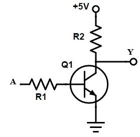
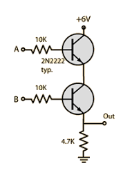
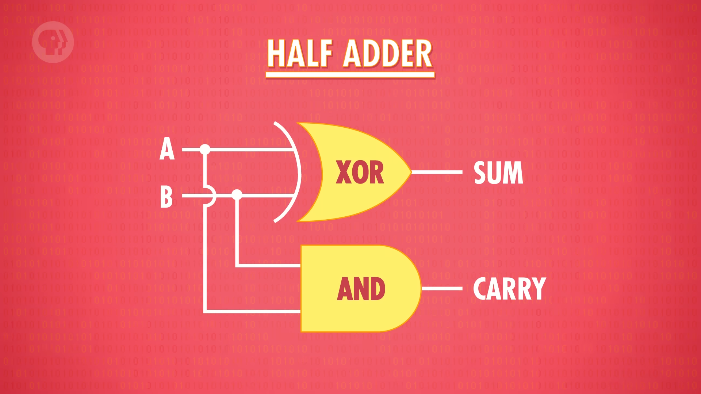
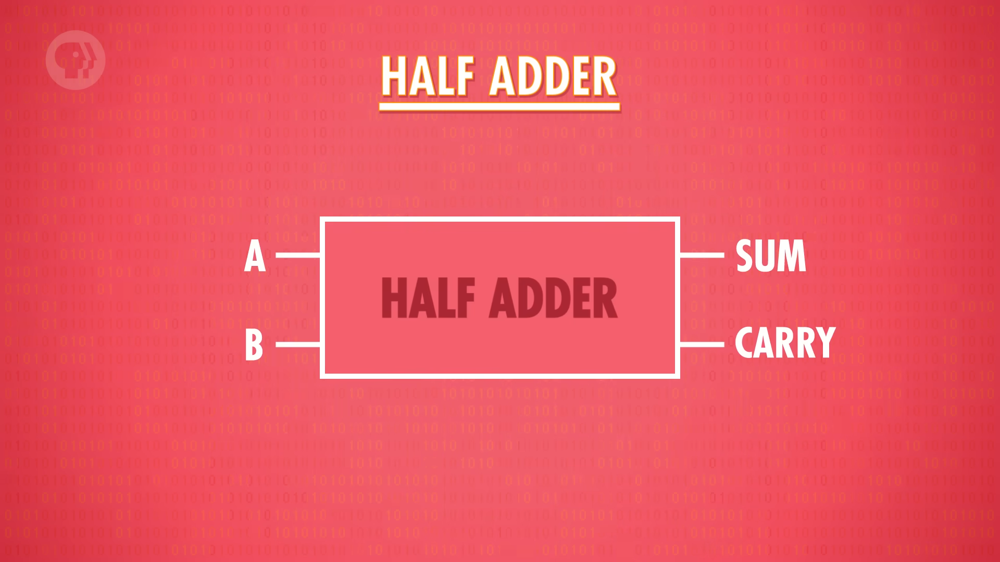
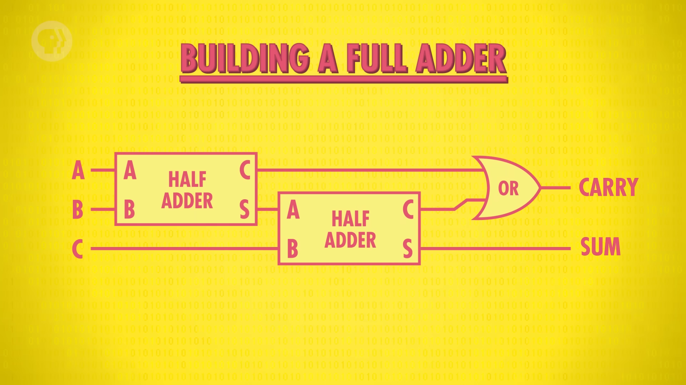
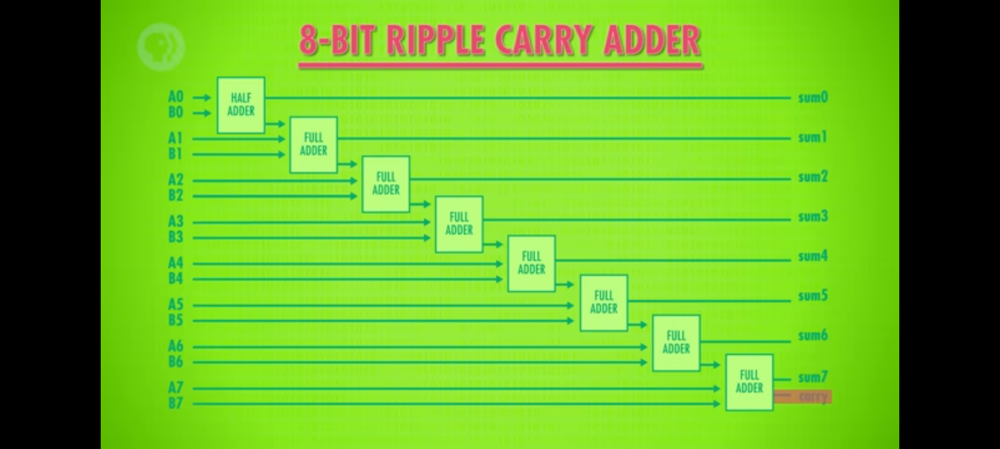
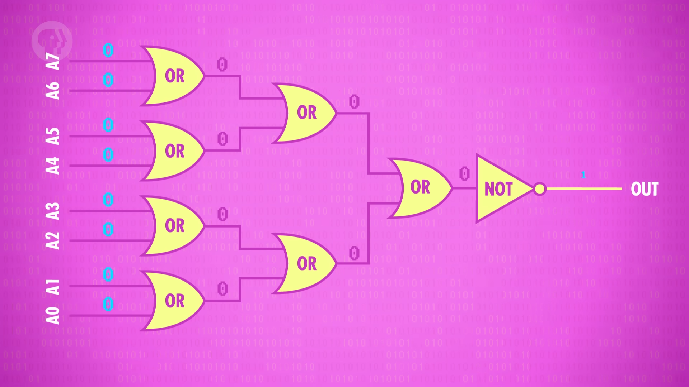
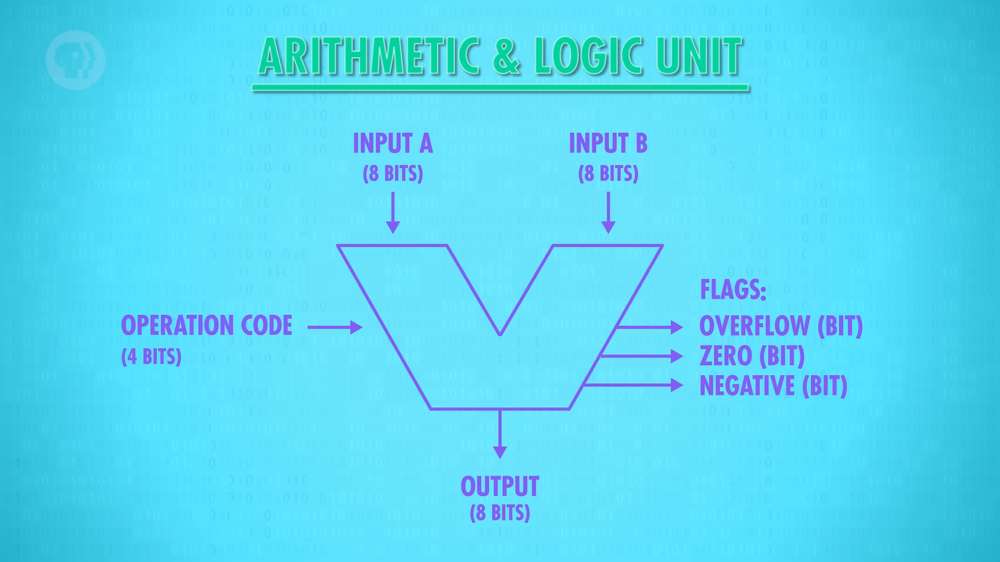

# Тема 1: Структура на компютърните системи

## Съдържание

1. [Основни компоненти на компютърната система](#1-основни-компоненти-на-компютърната-система)
2. [Булева алгебра. От транзистори до логически елементи](#2-булева-алгебра-от-транзистори-до-логически-елементи)
3. [Защо използваме двоична бройна система? Записване на положителни и отрицателни цели числа, дроби и символи с двоични числа](#3-защо-използваме-двоична-бройна-система-записване-на-положителни-и-отрицателни-цели-числа-дроби-и-символи-с-двоични-числа)
4. [Аритметично логическо устройство (АЛУ) - какво представлява и как се изгражда от логически елементи](#4-аритметично-логическо-устройство-алу---какво-представлява-и-как-се-изгражда-от-логически-елементи)
5. [Компютърна памет - регистри и Random Access Memory (RAM)](#5-компютърна-памет---регистри-и-random-access-memory-ram)
6. [Процесор на компютърната система](#6-процесор-на-компютърната-система)

---

## 1. Основни компоненти на компютърната система

_Фиг. 1.2.1.: Пример за структура на хардуера на компютърна система_

Всяка компютърна система съдържа следните 3 компонента:

- **Централен процесор (CPU)**

  - Изпълнява инструкии, обработва данни, изчислява.
  - Чрез него операционната система (ОС) контролира останалите компоненти.

- **Оперативна памет (RAM)**

  - Памет върху която можем да записваме информация и да я четем.
  - Използва се за запазване на инструкции към процесора и данни на приложните
    програми/операционната система (малко по-подробно в следващите точки).
  - Енергозависима - информацията не се пази при изключване на системата.

- **Системна шина (System bus)**

  - Компонент чрез който се извършва комуникацията между останалите компоненти.
  - Може да ви е познат още като дънна платка (motherboard).

Също така, почти винаги системата има и:

- **Входно/Изходни устройства (IO Devices)**

  - Устройства, с които операционната система може да комуникира - да изпраща информация
    към тях или да получава информация от тях.
  - Примери за входно-изходни устройства са мишките, принтерите, мониторите, записващите
    устройства, като HDD, SSD и т.н.
  - В частност ще разгледаме записващите устройства:
    - Енергонезависима памет - информацията се запазва, дори и системата да бъде
      изключена.
    - По-бавни и по-обемни от оперативната памет.

В следващата тема ще разгледаме как ОС управлява хардуера и предоставя достъп
до него на потребителските програми чрез API (приложно-програмен интерфейс).

## 2. Защо използваме двоична бройна система? Записване на положителни и отрицателни цели числа, дроби и символи с двоични числа

- **Защо компютърните системи използват 2 състояния, а не повече?**

  - Не винаги е било така - първите компютри използвали 10-ична бройна система.
    Това е било по-просто за хората, които са ги използвали/програмирали, но не
    и от механична и електрическа гледна. Примерно в някои варианти на много ранни
    компютърни системи, за запазването на 10-ичните числа са се използвали зъбни
    колела, като за всяко число са били нужни по 10 зъба.
  - Друг начин за използване на 10-ична бройна система в компютърна система е, чрез
    четене на степените на напрежение на електрически сигнал.
  - Проблемът с този подход е, че за да се представи едно число, са необходими
    повече състояния на електрически сигнал, което води до по-голяма сложност на
    електронните компоненти и по-голям шанс за грешки. Освен това, има по-голям
    шанс за грешки при пренос на информация породени от ел. шум и други фактори.
  - 2-ичната бройна система е по-подходяща за електронни устройства, тъй като
    транзисторите имат само 2 състояния - включен и изключен.
  - Обработката на двоичните числа е много по-лесна и по-бърза отколкото на
    10-ичните числа; електронните компоненти са по-евтини и по-надеждни.
  - Всички основни типове данни могат да бъдат представени чрез двоични числа.

- **Записване на цели числа**

  - Записване на положително число в двоична бройна система става по същия начин
    като в десетична, но със съответните степени на 2-ката.
    Пример: 10 (десетично) = 1010 (двоично)
  - В езика C, за да се отбележи, че числото е двоично, се добавя префикс `0b` пред
    числото. Пример: `0b1010`, `0b1010==10 // true`.
  - В езика C, има няколко възможни размери на целочислените типове:
    - `char` - 1 байт (8 бита)
    - `short` - 2 байта (16 бита)
    - `int` - 4 байта (32 бита)
    - `long` - 8 байта (64 бита)
    - `long long` - 8 байта (64 бита)
  - В C, за да се отбележи, че числото е отрицателно, първият бит се използва за
    знака (0 - положително, 1 - отрицателно).
  - Едно цяло число може да е signed или unsigned. В signed числата, първият бит
    се използва за знака, а в unsigned числата, първият бит се използва за представяне
    на числото.
    - Пример: `char` може да бъде `signed char` или `unsigned char`. Тогава стойностите
      на `char` са от -128 до 127, а на `unsigned char` от 0 до 255.

- **Записване на дроби**

  - Дробните числа в C са представени чрез `float` и `double`, които са с размери
    32 и 64 бита съответно.
  - Нека разгледаме как се представя 32 битово дробно число в двоична бройна система.
    
    _Фиг. 1.3.1.: IEEE 754 32-bit floating point_

    - Първият бит се използва за знака.
    - Следващите 8 бита се използват за експонентата на числото - степен на 2-ката,
      с която се умножава мантисата.
    - Останалите 23 бита се използват се наричат мантиса - дробната част на числото.
    - Пример: 2.5 == `0 10000000 01000000000000000000000`.
    - При 64 битовите числа, експонентата е 11 бита, а мантисата е 52 бита.

  - Важно е да се отбележи, че дробните числа в двоична бройна система са представени
    по същия начин като целите числа, но се използва и десетична запетая.

    - Пример: 2.5 == 0b10.1 (двоично).

  - При използване на дробни числа, винаги трябва да се има предвид, че те не винаги
    са точни и може да се получат грешки при изчисленията.
    - Пример: Пробвайте да изпълните следната проверка
      `0.1 + 0.2 == 0.30000000000000004// true`, в език за програмиране по ваш избор.

- **Записване на символи**

  - Символите също се представят чрез двоични числа.
  - В C, символите се представят чрез ASCII (American Standard Code for Information
    Interchange).
  - ASCII таблицата е 7-битова таблица и съдържа 128 символа.
    - Пример: `A` == `0b1000001`, `a` == `0b1100001`.
  - В C, символите се представят чрез типа `char` (1 байт, 8 бита).
  - В последствие на разпространението на компютрите по света, възниква нуждата
    да се добавят и допълнителни символи - примерно кирилица, китайски и японски.
    - Първоначално се използвали останалите 128 символа от ASCII таблицата за
      представяне на допълнителни символи. Всяка страна има своята таблица за символи.
    - Това води до проблеми при обмен на информация между различни компютърни системи.
      Съобщение изпратено от компютър на една страна може да не се представи правилно
      от компютър на друга страна.
    - За да се реши този проблем, се създават Unicode и UTF-8.
      - Unicode - 16 битова таблица, която съдържа повече от 65,000 символа.
      - UTF-8 - Unicode Transformation Format 8-bit, който представя Unicode символите
        с 1, 2, 3 или 4 байта.

- **Източници и материали**

  - [Why Computers Use Binary - Numberphile](https://youtu.be/thrx3SBEpL8)
  - [Floating Point Numbers - Computerphile](https://youtu.be/PZRI1IfStY0)
  - [Boolean Logic & Logic Gates: Crash Course Computer Science #3](https://youtu.be/gI-qXk7XojA)
  - [Representing Numbers and Letters with Binary: Crash Course Computer Science #4](https://youtu.be/1GSjbWt0c9M)

## 3. Булева алгебра. От транзистори до логически елементи

- **Логически елементи**

  

  _Фиг. 1.4.1.: Логически елементи_

  - Логическите елементи са електронни компоненти, които извършват логически операции
    над един или повече входни сигнали и генерират един или повече изходни сигнали.
  - Логическите елементи се използват за изграждане на логически схеми, които се
    използват в компютърните системи.
    - Примери за логически елементи са: AND, OR, NOT, XOR и др.
    - От основно значение за компютърните системи са логическите елементи AND, OR,
      NOT и XOR, така че ще ги разгледаме в следващите точки.

- **Логически елемент NOT**

  - Логическият елемент NOT (инвертор) е елемент, който променя състоянието на входния
    сигнал.

    - Входът на логическия елемент NOT може да бъде 0 или 1.
    - Ако входът е 0, то изходът е 1.
    - Ако входът е 1, то изходът е 0.

  - Таблица на истинност:

    | A   | Q   |
    | --- | --- |
    | 0   | 1   |
    | 1   | 0   |

  - Електреската схема на NOT се състои от 1 транзистор. При подаване на напрежение
    на входният сигнал (базата на транзистора) се отваря транзистора и токът преминава
    през него, към земята. Съответно, изходният сигнал е 0. При липса на напрежение
    на входният сигнал, транзистора е затворен и токът не може да премине през него.
    Тогава, изходният сигнал е 1.

    

    _Фиг. 1.4.2.: Електрическа схема на NOT_

- **Логически елемент AND**

  - Логическият елемент AND е елемент, който извършва логическа операция "И" над
    два входни сигнала.
    - Входът на логическия елемент AND може да бъде 0 или 1.
    - Ако и двата входа са 1, то изходът е 1.
    - В противен случай, изходът е 0.
  - Таблица на истинност:

    | A   | B   | Q   |
    | --- | --- | --- |
    | 0   | 0   | 0   |
    | 0   | 1   | 0   |
    | 1   | 0   | 0   |
    | 1   | 1   | 1   |

  - Електрическата схема на логическия елемент AND се състои от 2 транзистора и 2
    входа. При подаване на напрежение на входните сигнали (базите на транзисторите)
    се отварят транзисторите и токът преминава през тях, към земята. Съответно,
    изходният сигнал, който е свързан към изхода на транзисторите, е 1. При липса
    на напрежение на някой от входните сигнали, токът не може да премине през транзисторите.
    Тогава, изходният сигнал е 0.

    

    _Фиг. 1.4.3.: Електрическа схема на AND_

- **Логически елемент OR**

  - Логическият елемент OR е елемент, който извършва логическа операция "ИЛИ" над
    два входни сигнала.
    - Входът на логическия елемент OR може да бъде 0 или 1.
    - Ако поне един от входовете е 1, то изходът е 1.
    - В противен случай, изходът е 0.
  - Таблица на истинност:

    | A   | B   | Q   |
    | --- | --- | --- |
    | 0   | 0   | 0   |
    | 0   | 1   | 1   |
    | 1   | 0   | 1   |
    | 1   | 1   | 1   |

  - Електрическата схема на OR се състои от 2 транзистора и 2 входа, свързани към
    базите на транзисторите. При липса на напрежение на входните сигнали, транзисторите
    са затворени и токът не може да премине през тях и изходният сигнал е 0. При
    подаване на напрежение на поне един от входните сигнали, транзисторите се отварят
    и токът преминава през тях към земята. Съответно, изходният сигнал е 1.

    

    _Фиг. 1.4.4.: Електрическа схема на OR_

- **Логически елемент XOR**

  - Логическият елемент XOR е елемент, който извършва логическа операция "ИЗКЛЮЧВАЩО
    ИЛИ" над два входни сигнала.

    - Входът на логическия елемент XOR може да бъде 0 или 1.
    - Ако входовете са различни, то изходът е 1.
    - В противен случай, изходът е 0.

  - Таблица на истинност:

    | A   | B   | Q   |
    | --- | --- | --- |
    | 0   | 0   | 0   |
    | 0   | 1   | 1   |
    | 1   | 0   | 1   |
    | 1   | 1   | 0   |

  - Електрическата схема на XOR се състои от 4 транзистора и 2 входа. При липса на
    напрежение на входните сигнали, транзисторите са затворени и токът не може да
    премине през тях и изходният сигнал е 0. При подаване на напрежение на един от
    входните сигнали, транзисторите се отварят и токът преминава през тях към земята.
    Съответно, изходният сигнал е 1. При подаване на напрежение на двата входа,
    токът преминава през транзисторите и изходният сигнал е 0.

    

    _Фиг. 1.4.5.: Логическа схема на XOR_

- **Източници и материали**
  - [Boolean Logic & Logic Gates: Crash Course Computer Science #3](https://youtu.be/gI-qXk7XojA)

## 5. Аритметично логическо устройство (АЛУ) - какво представлява и как се изгражда от логически елементи

- **Какво е АЛУ?**

  - Аритметично логическото устройство (АЛУ) е част от централния процесор (Central
    Processing Unit, CPU), която извършва аритметични и логически операции.
  - Представлява математическия "мозък" на компютърната система.
  - АЛУ-то може да извършва операции като събиране, изваждане, умножение, деление.
    Също така, изпълнява логически операции като AND, OR, NOT, XOR и др.
  - АЛУ-то получава входни данни от регистри (ще разгледаме какво представляват
    те по-надолу) и изпраща резултата на операциите обратно в регистрите.
  - Разделено е на 2 части:
    - Аритметична част - извършва аритметични операции, като събиране, изваждане,
      умножение, увеличаване на стойност и др.
    - Логическа част - извършва логически операции, като например, проверка на равенство,
      проверка за по-голямо, по-малко, AND, OR, NOT, XOR и др.
  - Ще разгледаме събирането на две двоични числа като пример за аритметична операция
    на АЛУ-то, но е важно да се отбележи, че това далеч не е единствената операция,
    която може да извършва.
  - Също така, ще разгледаме операцията "сравняване на число с 0", като пример за
    логическа операция. Тя, примерно, може да се използва при сравнението за равенство
    на 2 n-битови числа.

- **Реализация на суматор с логически елементи**

  - **Half-Adder**

    - Първоначално ще разгледаме Half-Adder. Той е най-простия логически елемент,
      който извършва събиране на две единични бита.
    - Half-Adder има 2 входа - A и B и 2 изхода - сума (S) и пренос (C).
    - Има четири възможни комбинации на входните сигнали и съответните изходи:

      | A   | B   | C   | S   |
      | --- | --- | --- | --- |
      | 0   | 0   | 0   | 0   |
      | 0   | 1   | 0   | 1   |
      | 1   | 0   | 0   | 1   |
      | 1   | 1   | 1   | 0   |

  - Логическата схема на Half-Adder се състои от 2 логически елемента - XOR и AND.
    Входните сигнали се подават на XOR, който определя стойността на сумата и на
    AND - определящ остатъка.

    
    

    _Фиг. 1.5.1.: Half-Adder_

  - **Full-Adder**

    - Full-Adder извършва събиране на 3 бита - две входни стойности и остатък от
      предишно събиране.

    - Приема 3 входа - A, B и C (остатък от предишно събиране) и има 2 изхода - сума
      (Sum) и пренос (Carry).

    - Има осем възможни комбинации на входните сигнали и съответните изходи:

      | A   | B   | C   | Sum | Carry |
      | --- | --- | --- | --- | ----- |
      | 0   | 0   | 0   | 0   | 0     |
      | 0   | 0   | 1   | 1   | 0     |
      | 0   | 1   | 0   | 1   | 0     |
      | 0   | 1   | 1   | 0   | 1     |
      | 1   | 0   | 0   | 1   | 0     |
      | 1   | 0   | 1   | 0   | 1     |
      | 1   | 1   | 0   | 0   | 1     |
      | 1   | 1   | 1   | 1   | 1     |

    - Логическа схема на Full-Adder може да. се изгради от 2 Half-Adder-а и един
      OR gate.

      
      

      _Фиг. 1.5.2.: Full-Adder_

  - **N-битов суматор**

    - Нека имаме 2 n-битови числа A и B, които искаме да съберем.

      - Цифрите на числата ще представяме с An-1, An-2, ...,
        A0 и Bn-1, Bn-2, ..., B0.

    - Започваме от най-младшите битове (т.е. A0 и B0):

      - При събиране на двата бита A0 и B0 получаваме сума S0
        и пренос C0.
      - Сумата S0 е равна на A0 XOR B0>.
      - Преносът C0 е равен на A0 AND B0>.
      - За събирането използваме Half-Adder, защото имаме само 2 входни бита.

    - При събирането на всеки два следващи бита Ai и Bi (i > 0):
      - За събирането използваме Full-Adder, защото имаме 3 входни бита - . Ai,
        Bi и преноса от предишното събиране Ci-1.
      - Сумата Si е равна на Ai XOR Bi XOR Ci-1.
      - Преносът Ci е равен на (Ai AND Bi) OR
        (Ai AND Ci-1) OR (Bi AND Ci-1).

  - Схема на N-битов суматор:

    

    _Фиг. 1.5.3.: N-bit Adder_

- **Реализация на сравнение на число с 0 с логически елементи**

  - Освен аритметични операции, АЛУ може да извършва и логически операции.

  - Пример за това е сравнението на число с 0.

    

    _Фиг. 1.5.4.: Логическа схема за проверяване на това, дали 4-битово число е равно на нула_

- **Реализация на ALU**

  - Както вече споменахме, ALU не се ограничава само до горепосочените операции.
    То може да извършва много други операции, като изваждане, деление, сравнение
    на числа, логически операции, увеличаване на стойности, местене на контролни
    регистри и др.

  - Схемата на ALU се изгражда от множество логически схеми, които извършват
    различни операции.

  - Правилната логическа схема за дадена операция се избира чрез т.нар. код на
    операцията (operation code). Този код се подава на ALU и избира съответната
    логическа схема за изпълнение. Може да приемете, че всяка схема има единствен
    такъв асоцииран код.

  - В зависимост от операцията, АЛУ може да приеме различен брой входове и различен
    брой изходи.

    - В случая на събиране на две числа, АЛУ приема две n-битови числа и връща
      n-битово число.

  - АЛУ, също така, има флагови регистри. Те може да съдържат информация, като за
    overflow при събиране, равенство на нула (схемата, която реализирахме в горната
    точка), отрицание на резултата и др.

  - АЛУ-то работи с регистри. Регистрите са малки паметни устройства, които се
    използват за съхранение на данни. Те са изградени от D-тригери и се използват
    за съхранение на резултатите от операциите на АЛУ-то.

    - Повече за тях ще разгледаме в следващата точка. :)

  - Репрезентация на ALU:

    

    _Фиг. 1.5.5.: Аритметично логическо устройство (АЛУ)_

- **Източници и материали**
  - [How Computers Calculate - the ALU: Crash Course Computer Science #5](https://youtu.be/1I5ZMmrOfnA)

## 5. Компютърна памет - регистри и Random Access Memory (RAM)

- **Източници и материали**
  - [Registers and RAM: Crash Course Computer Science #6](https://youtu.be/fpnE6UAfbtU)

## 6. Процесор на компютърната система

- **Източници и материали**
  - [Central Processing Unit (CPU): Crash Course Computer Science #7](https://youtu.be/FZGugFqdr60)
